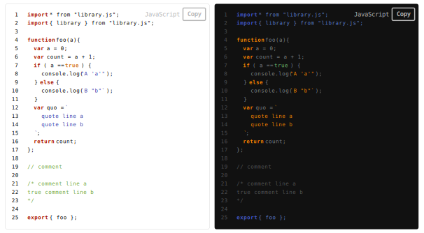
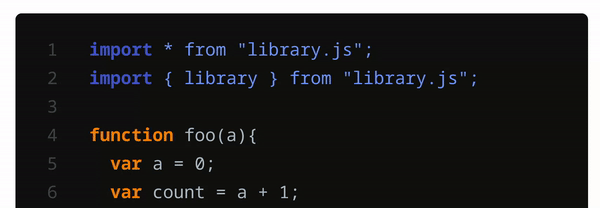

## **Preface**

**Emphase** is an Open Source project of **VivaRado**.

<div markdown='1' class="header_logo">


</div>

<div markdown='1' class="header_preview">



</div>


##  **Introduction**

Emphase is a code highlight library, emphasize your syntax!

#### Contributors:

*  VivaRado <support@vivarado.com>
*  Andreas Kalpakidis
*  Madina Akhmatova

---

### **Profile**
<sub>Introduction / Profile</sub>

<br>


*   Company: VivaRado LLP
*   Designer: Andreas Kalpakidis
*   Twitter: [@vivarado](https://twitter.com/VivaRado)
*   OpenSea: [@vivarado](https://opensea.io/vivarado)


---


### **Project Overview**
<sub>Introduction / Project Overview</sub>

<br>


*   Project Name: Emphase
*   Code Name: EM
*   Proposal Date: 25/12/2023

---

### **Design**


Emphase is a Javascript code highlight script aiming to be small but legible and extendable.

It consists of the **LanguageLoader**, a **CacheManager** and an **Elementmaker** and **Utils**.


---

### **LanguageLoader**
<sub>Design / LanguageLoader</sub>

<br>


The **LanguageLoader** is responsible for loading the languages on the client or server and caching them for later use.

---

### **CacheManager**
<sub>Design / CacheManager</sub>

<br>


The **CacheManager** is responsible for locating the keywords and other details provided in the language files, replacing them with temporary hashes and storing the formatted HTML for later replacement.

---

### **ElementMaker**
<sub>Design / ElementMaker</sub>

<br>


The **ElementMaker** is for creating the various HTML elements needed to display Emphase code blocks on the page.

---

### **Production**


To work on extending this module a few thigs are provided:

Run in browser with reload allong with gulp watch:

```
npm run dev
```

<br>

Just build with gulp

```
npm run build
```

Work is done on the ES files. Gulp is structured to take these ES contents of ```src/es/*``` convert them to CJS and then broswerify them and put them to ```lib```.

---

### **Installation**


To install:

```
npm install emphase
```

<br>

On the client side, wether you want to use the library headless or acting on an element, you will need to include:

<br>

the **CSS**:

```html
<link href="../lib/em.css" rel="stylesheet" type="text/css">
```

<br>

the **Javascript**:

```html
<script src="../lib/em.js" type="text/javascript"></script>
```

<small>*Common JS (CJS)*</small>

```html
<script src="../src/em.es.js" type="module"></script>
```

<small>*ES (ECMAScript module)*</small>

<br>

and the **language file**(s) you will need:

```html
<script src="../src/languages/em_bash.js" type="text/javascript"></script>
```

---

### **Usage**


Emphase comes in common and module flavor. After installation you can use Emphase on an element using the **emphasize** function with the language you need included with a script tag, or headless by providing some **code** (string) and the **language** (string) parameters.

Usage Scenarios:

* ES (ECMAScript module):
    * Element (client-side)
    * Headless (server-side or client-side)
* Common JS (CJS):
    * Element (client-side)
    * Headless (server-side or client-side)


*You do not need to include the language if you are using emphase on the server side.*

---

### **ES Element**:
<sub>Usage / ES Element</sub>

<br>


#### Element:

```html
<code class="lang-bash">
#!/bin/bash

if [ $a  -eq  true ]
then
  echo "A 'a'"
else
  echo "B 'b'"
fi
'</code>
```

#### Language Include:

```html
<script src="./src/languages/em_bash.js" type="text/javascript"></script>  
```

#### Script:

```javascript
import {Emphase} from 'Emphase';
var em = new emphase();

console.log( em.emphasize(document.querySelector(".lang-bash"), 'bash').result );
```

---

### **CJS Element**:
<sub>Usage / CJS Element</sub>

<br>


#### Element:

```html
<code class="lang-bash">
#!/bin/bash

if [ $a  -eq  true ]
then
  echo "A 'a'"
else
  echo "B 'b'"
fi
'</code>
```

#### Language Include:

```html
<script src="./src/languages/em_bash.js" type="text/javascript"></script>  
```

#### Script:

```javascript
const emphase = require("emphase");
var em = new emphase();

console.log( em.emphasize(document.querySelector(".lang-bash"), 'bash').result );
```

---

### **ES Headless**:
<sub>Usage / ES Headless</sub>

<br>


```javascript
import {Emphase} from 'Emphase';
var em = new emphase();

string = `
#!/bin/bash

if [ $a  -eq  true ]
then
  echo "A 'a'"
else
  echo "B 'b'"
fi
`;

console.log( em.emphasize(string, 'bash').result );

```

---

### **CJS Headless**:
<sub>Usage / CJS Headless</sub>

<br>


```javascript
const emphase = require("emphase");
var em = new emphase();

string = `
#!/bin/bash

if [ $a  -eq  true ]
then
  echo "A 'a'"
else
  echo "B 'b'"
fi
`;

console.log( em.emphasize(string, 'bash').result );

```

---

### **Features**


* Modern interface.
* Extensive and Deep Language Coverage.
* Light and Dark Theme.
* Client and Server Side.
* ~350 lines of code uncompressed.

---

### **User Interface**
<sub>Features / User Interface</sub>

<br>


**Overfading Numbers Tab**



---

### **Syntax Support**
<sub>Features / Syntax Support</sub>

<br>


**Support Syntax:**

* Keywords
* Values
* Directives
* Comments
* Comment Blocks
* Strings
* String Blocks

<br>

**Current Language Support**:


| Name       | Friendly Name | Comments   | Comment Blocks      | Strings   | String Blocks      | Keywords | Values | Directives  |
|------------|---------------|------------|---------------------|-----------|--------------------|----------|--------|-------------|
| bash       | Bash          | True       | True                | True      | False              | True     | True   | True        |
| c          | C             | True       | True                | True      | True               | True     | True   | True        |
| cpp        | C++           | True       | True                | True      | True               | True     | True   | True        |
| cs         | C#            | True       | True                | True      | False              | True     | True   | True        |
| fs         | F#            | True       | True                | True      | False              | True     | True   | False       |
| go         | Go            | True       | True                | True      | True               | True     | True   | True        |
| html       | HTML          | True       | True                | True      | False              | True     | False  | False       |
| java       | Java          | True       | True                | True      | True               | True     | True   | True        |
| javascript | JavaScript    | True       | True                | True      | True               | True     | True   | True        |
| kotlin     | Kotlin        | True       | True                | True      | True               | True     | True   | True        |
| matlab     | Matlab        | True       | True                | True      | False              | True     | True   | False       |
| perl       | Perl          | True       | False               | True      | True               | True     | True   | False       |
| python     | Python        | True       | True                | True      | True               | True     | True   | True        |
| r          | R             | True       | False               | True      | False              | True     | True   | False       |
| ruby       | Ruby          | True       | True                | True      | False              | True     | True   | False       |
| rust       | Rust          | True       | True                | True      | False              | True     | True   | False       |
| scala      | Scala         | True       | True                | True      | False              | True     | True   | False       |
| sql        | SQL           | True       | True                | True      | False              | True     | False  | False       |
| swift      | Swift         | True       | True                | True      | False              | True     | True   | False       |
| typescript | TypeScript    | True       | True                | True      | False              | True     | True   | False       |
| vb         | Visual Basic  | True       | True                | True      | False              | True     | True   | False       |

---

### **Glossary**


**Emphase**: [em-fuh-see].

---


### **Reference**


Language Keywords from [jsyntax](https://www.npmjs.com/package/jsyntax.js)

---

## **Preface**

**Emphase** is an Open Source project of **VivaRado**.

<div markdown='1' class="header_logo">


</div>

<div markdown='1' class="header_preview">


</div>


##  **Introduction**

Emphase is a code highlight library, emphasize your syntax!

#### Contributors:

*  VivaRado <support@vivarado.com>
*  Andreas Kalpakidis
*  Madina Akhmatova

---

### **Profile**
<sub>Introduction / Profile</sub>

<br>


*   Company: VivaRado LLP
*   Designer: Andreas Kalpakidis
*   Twitter: [@vivarado](https://twitter.com/VivaRado)
*   OpenSea: [@vivarado](https://opensea.io/vivarado)


---


### **Project Overview**
<sub>Introduction / Project Overview</sub>

<br>


*   Project Name: Emphase
*   Code Name: EM
*   Proposal Date: 25/12/2023

---

### **Design**


Emphase is a Javascript code highlight script aiming to be small but legible and extendable.

It consists of the **LanguageLoader**, a **CacheManager** and an **Elementmaker** and **Utils**.


---

### **LanguageLoader**
<sub>Design / LanguageLoader</sub>

<br>


The **LanguageLoader** is responsible for loading the languages on the client or server and caching them for later use.

---

### **CacheManager**
<sub>Design / CacheManager</sub>

<br>


The **CacheManager** is responsible for locating the keywords and other details provided in the language files, replacing them with temporary hashes and storing the formatted HTML for later replacement.

---

### **ElementMaker**
<sub>Design / ElementMaker</sub>

<br>


The **ElementMaker** is for creating the various HTML elements needed to display Emphase code blocks on the page.

---

### **Production**


To work on extending this module a few thigs are provided:

Run in browser with reload allong with gulp watch:

```
npm run dev
```

<br>

Just build with gulp

```
npm run build
```

Work is done on the ES files. Gulp is structured to take these ES contents of ```src/es/*``` convert them to CJS and then broswerify them and put them to ```lib```.

---

### **Installation**


To install:

```
npm install emphase
```

<br>

On the client side, wether you want to use the library headless or acting on an element, you will need to include:

<br>

the **CSS**:

```html
<link href="../lib/em.css" rel="stylesheet" type="text/css">
```

<br>

the **Javascript**:

```html
<script src="../lib/em.js" type="text/javascript"></script>
```

<small>*Common JS (CJS)*</small>

```html
<script src="../src/em.es.js" type="module"></script>
```

<small>*ES (ECMAScript module)*</small>

<br>

and the **language file**(s) you will need:

```html
<script src="../src/languages/em_bash.js" type="text/javascript"></script>
```

---

### **Usage**


Emphase comes in common and module flavor. After installation you can use Emphase on an element using the **emphasize** function with the language you need included with a script tag, or headless by providing some **code** (string) and the **language** (string) parameters.

Usage Scenarios:

* ES (ECMAScript module):
    * Element (client-side)
    * Headless (server-side or client-side)
* Common JS (CJS):
    * Element (client-side)
    * Headless (server-side or client-side)


*You do not need to include the language if you are using emphase on the server side.*

---

### **ES Element**:
<sub>Usage / ES Element</sub>

<br>


#### Element:

```html
<code class="lang-bash">
#!/bin/bash

if [ $a  -eq  true ]
then
  echo "A 'a'"
else
  echo "B 'b'"
fi
'</code>
```

#### Language Include:

```html
<script src="./src/languages/em_bash.js" type="text/javascript"></script>  
```

#### Script:

```javascript
import {Emphase} from 'Emphase';
var em = new emphase();

console.log( em.emphasize(document.querySelector(".lang-bash"), 'bash').result );
```

---

### **CJS Element**:
<sub>Usage / CJS Element</sub>

<br>


#### Element:

```html
<code class="lang-bash">
#!/bin/bash

if [ $a  -eq  true ]
then
  echo "A 'a'"
else
  echo "B 'b'"
fi
'</code>
```

#### Language Include:

```html
<script src="./src/languages/em_bash.js" type="text/javascript"></script>  
```

#### Script:

```javascript
const emphase = require("emphase");
var em = new emphase();

console.log( em.emphasize(document.querySelector(".lang-bash"), 'bash').result );
```

---

### **ES Headless**:
<sub>Usage / ES Headless</sub>

<br>


```javascript
import {Emphase} from 'Emphase';
var em = new emphase();

string = `
#!/bin/bash

if [ $a  -eq  true ]
then
  echo "A 'a'"
else
  echo "B 'b'"
fi
`;

console.log( em.emphasize(string, 'bash').result );

```

---

### **CJS Headless**:
<sub>Usage / CJS Headless</sub>

<br>


```javascript
const emphase = require("emphase");
var em = new emphase();

string = `
#!/bin/bash

if [ $a  -eq  true ]
then
  echo "A 'a'"
else
  echo "B 'b'"
fi
`;

console.log( em.emphasize(string, 'bash').result );

```

---

### **Features**


* Modern interface.
* Extensive and Deep Language Coverage.
* Light and Dark Theme.
* Client and Server Side.
* ~350 lines of code uncompressed.

---

### **User Interface**
<sub>Features / User Interface</sub>

<br>


**Overfading Numbers Tab**


---

### **Syntax Support**
<sub>Features / Syntax Support</sub>

<br>


**Support Syntax:**

* Keywords
* Values
* Directives
* Comments
* Comment Blocks
* Strings
* String Blocks

<br>

**Current Language Support**:


| Name       | Friendly Name | Comments   | Comment Blocks      | Strings   | String Blocks      | Keywords | Values | Directives  |
|------------|---------------|------------|---------------------|-----------|--------------------|----------|--------|-------------|
| bash       | Bash          | True       | True                | True      | False              | True     | True   | True        |
| c          | C             | True       | True                | True      | True               | True     | True   | True        |
| cpp        | C++           | True       | True                | True      | True               | True     | True   | True        |
| cs         | C#            | True       | True                | True      | False              | True     | True   | True        |
| fs         | F#            | True       | True                | True      | False              | True     | True   | False       |
| go         | Go            | True       | True                | True      | True               | True     | True   | True        |
| html       | HTML          | True       | True                | True      | False              | True     | False  | False       |
| java       | Java          | True       | True                | True      | True               | True     | True   | True        |
| javascript | JavaScript    | True       | True                | True      | True               | True     | True   | True        |
| kotlin     | Kotlin        | True       | True                | True      | True               | True     | True   | True        |
| matlab     | Matlab        | True       | True                | True      | False              | True     | True   | False       |
| perl       | Perl          | True       | False               | True      | True               | True     | True   | False       |
| python     | Python        | True       | True                | True      | True               | True     | True   | True        |
| r          | R             | True       | False               | True      | False              | True     | True   | False       |
| ruby       | Ruby          | True       | True                | True      | False              | True     | True   | False       |
| rust       | Rust          | True       | True                | True      | False              | True     | True   | False       |
| scala      | Scala         | True       | True                | True      | False              | True     | True   | False       |
| sql        | SQL           | True       | True                | True      | False              | True     | False  | False       |
| swift      | Swift         | True       | True                | True      | False              | True     | True   | False       |
| typescript | TypeScript    | True       | True                | True      | False              | True     | True   | False       |
| vb         | Visual Basic  | True       | True                | True      | False              | True     | True   | False       |

---

### **Glossary**


**Emphase**: [em-fuh-see].

---


### **Reference**


Language Keywords from [jsyntax](https://www.npmjs.com/package/jsyntax.js)

---

