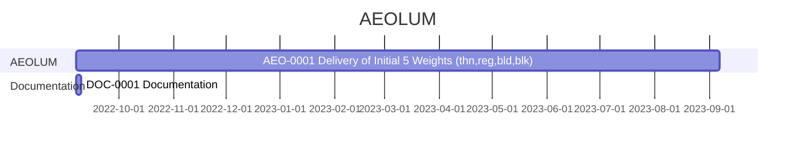

```{include=partials/introduction/profile_project.md,M0}```


---


```{include=partials/introduction/phase_introduction/phase_introduction.md,M0}```


---

### **Phases / Initiation Phase**

*  **Initiation Phase** Components ∞0.001:
	
	1.  **Business Case**:
		*  Strategic case 
		*  Management case

---

### **Phases / Initiation Phase / Business Case**

```{include=partials/introduction/phase_introduction/initiation_phase/business_case.md}```


---

### **Phases / Initiation Phase / Business Case / Strategic case**

```{include=partials/introduction/phase_introduction/initiation_phase/business_case/strategic_case/strategic_case.md}```

---

### **Phases / Initiation Phase / Business Case / Financial Case**

```{include=partials/introduction/phase_introduction/initiation_phase/financial_case.md}```


---

### **Phases / Initiation Phase / Business Case / Management case**

```{include=partials/introduction/phase_introduction/initiation_phase/business_case/management_case/management_case.md}```

---

### **Phases / Initiation Phase / Business Case / Management case / Achievements Plan**

```{include=partials/introduction/phase_introduction/initiation_phase/business_case/management_case/achievements_plan.md}```

---

### **Phases / Initiation Phase / Project Charter**


*  **Project Charter** Components ∞0.001:
	*  Project Introduction
	*  Project Goals
	*  Deliverables
	*  Duration

---

### **Phases / Initiation Phase / Project Charter / Project Introduction**

*  **Project Introduction** Components ∞0.001:

	*  Project Statements
		*  Vision Statement
		*  Mission Statement
	*  Project Definition
		*  Problem 
		*  Opportunity

---

### **Phases / Initiation Phase / Project Charter / Project Introduction / Project Statements**

```{include=partials/introduction/phase_introduction/initiation_phase/project_charter/project_statements.md}```


---


### **Phases / Initiation Phase / Project Charter / Project Goals**

*  Goals for ∞ 1.00:
	*  Delivery of AEOLUM in 5 Weights
	*  Delivery of AEOLUM in Latin, Greek, Cyrillic
	*  Delivery of Variable AEOLUM


---


### **Phases / Initiation Phase / Project Charter / Deliverables**

*  **Deliverables** Components ∞0.001:
	*  AEOLUM Font Instances
	*  AEOLUM Font Variable
	
---

### **Phases / Initiation Phase / Project Charter / Duration**

*  **Duration** of AEO ∞1.00:
	*  Roughly 2022 to 2023.


---


### **Phases / Planning Phase**

The Planning Phase, is where the project solution is further developed in as much detail as possible and the steps necessary to meet the project’s objectives.
The project's **Work Plan / Project Plan** is created outlining the activities, tasks, dependencies, and timeframes.

The Planning Phase consists of:

1. **Project Plan**:
1. **Work Plan**:
1. **Schedule Plan**:
1. **Stakeholders**
1. **Quality Plan (PQP)**


---


```{include=partials/introduction/phase_introduction/planning_phase/project_plan_actual.md}```

---

### **Phases / Planning Phase / Work Plan**


AEOLUM **Work Plan** is created outlining the activities, tasks, dependencies, and timeframes.

*  Work Plan:
	*  Tasks Assignments
	*  Dependencies

---


### **Phases / Planning Phase / Work Plan / Task Assignments**

*  **Docs Update**:
	*  VivaRado, Andreas Kalpakidis (∞1):
*  **AEOLUM**:
	*  VivaRado, Andreas Kalpakidis (∞1):

---

### **Phases / Planning Phase / Work Plan / Dependencies**

BUMP

---

### **Phases / Planning Phase / Schedule Plan**

```{include=partials/introduction/phase_introduction/planning_phase/schedule_planning.md}```

---

### **Phases / Planning Phase / Schedule Plan / Timeline**

Overview:





*  Current:
    *  **AEO-0001** / from September 07 2022 to September 07 2023, a very broad initial estimation:

<small>Strike Through Equals Completion</small>


Task Codes:

*  AEO-∞-∞: AEOLUM Test Font
*  DOC-∞-∞: Documentation


---


### **Phases / Planning Phase / Stakeholders**

We identify the **Stakeholders** by a **Personnel Plan** and create a **Communication Plan** to keep the **Stakeholders** informed.


*  **Stakeholders** Components:

	*  Applicable Stakeholders (Concious and Unconcious Entities):
		*  clients
		*  personell
		*  funders
		*  suppliers
		*  equipment
	*  Glyph Design Team (GyT)
	*  Kern Testing Team (KeT)
	*  Quality Assurance Team (QaT)
	*  Programming Team (PgT)


---


### **Phases / Planning Phase / Stakeholders / Personnel Plan**

*  Personnel Plan
	*  Organizational Structure
		*  team members
			*  internal
				*  Andreas Kalpakidis (∞1)
				*  Madina Akhmatova (∞1)
	*  Responsibilities and Qualifications
		*  Project Management and Accounting: Madina Akhmatova (∞1)
		*  Planning, Development and Design: Andreas Kalpakidis (∞1)

---

### **Phases / Planning Phase / Stakeholders / Communication Plan**

*  Communication Plan
	*  Stakeholder Feedback Mechanisms
		*  Weekly Notifications
			*  Twitter
			*  LinkedIn
	*  User Feedback Mechanisms:
		*  <support@vivarado.com>

---


### **Phases / Planning Phase / Quality Plan**

A **Quality Plan** describes the activities, standards, tools and processes necessary to achieve quality in the delivery of a project.

We can now create a **Quality Plan** by identifying the valid **Quality Targets** we want to achieve. Identify the **Quality Policies** that will be required to achieve them. Identify how to do **Quality Measurement**. Lastly identify how to maintain quality with **Quality Management**.


*  **Quality Plan (PQP)** Components:
	
	1.  Quality Targets
	1.  Quality Management

---

### **Phases / Planning Phase / Quality Plan / Quality Targets**

**Quality Targets** we want to achieve and what are their **Acceptance Criteria**, **Quality Management Procedures**, for each **Applicable Category**

1.  Quality Targets Components:
	*  Acceptance criteria
	*  Quality Management procedures

---

### **Phases / Planning Phase / Quality Plan / Quality Management**

**Quality Management**, the nature of the **Audits**, **Work Verification** by assigning responsible personnel for **Task Fulfillment** and **Task Checking**.

1.  Quality Management
	*  Audits
	*  Tool Scheduling
	*  Work Verification
		*  Task fulfillment responsible personnel 
			*  VivaRado
		*  Task checking responsible personnel
			*  VivaRado


---

