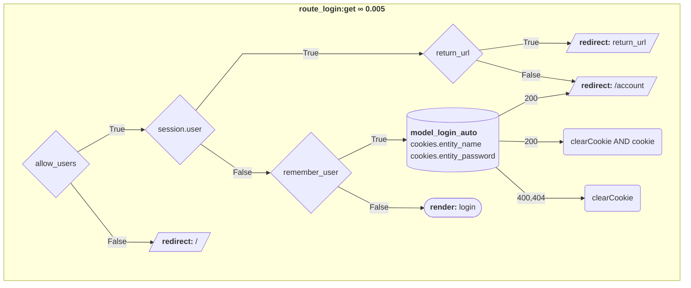
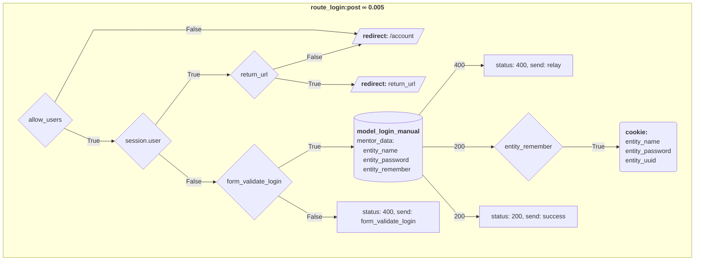
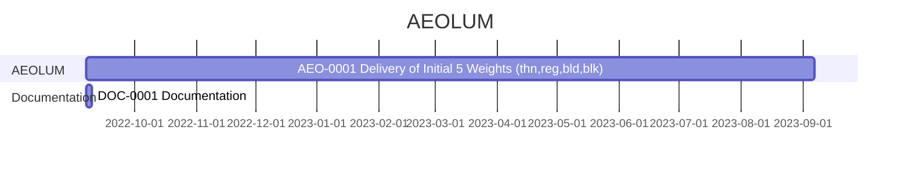

## **Preface**

**SymbolFont** is an Open Source project of **VivaRado**.

<div markdown='1' class="header_logo">


</div>


<div markdown='1' class="sidebar">

### **Contents**

1.  **Preface**
1.  **Profile**
1.  **Project Overview**
1.  **Phases**
    1.  **Initiation Phase**
        1.  **Business Case**
            1.  **Strategic case**
            1.  **Financial case**
            1.  **Management case**
                1.  **Achievements Plan**
        1.  **Project Charter**
            1.  **Project Introduction**
                1.  **Project Statements**
            1.  **Project Goals**
            1.  **Deliverables**
            1.  **Duration**
    1.  **Planning Phase**
        1.  **Project Plan**
            1.  **Design**
                1.  **Module Structure**
                    1.  **Models**
                    1.  **Views**
                    1.  **Controllers**
                    1.  **Routes**
                    1.  **Disputes**
                    1.  **Databases**
                    1.  **CLI**
                1.  **Modules**
                    1.  **Entity**
            1.  **Production**
            1.  **Installation**
            1.  **Usage**
                1.  **CLI Usage**
        1.  **Work Plan**
            1.  **Task Assignments**
            1.  **Dependencies**
        1.  **Schedule Plan**
            1.  **Timeline**
        1.  **Stakeholders**
            1.  **Personnel Plan**
            1.  **Communication Plan**
            1.  **Funding Plan**
        1.  **Quality Plan**
            1.  **Quality Targets**
            1.  **Quality Management**

### Glossary

1.  **Glossary**

### Reference

1.  **Reference**

</div>

##  **Introduction**

SymbolFont is a method of publishing symbols universally accessible through ligatures. Is also a library of symbols created by VivaRado for various projects as needed, and eventually open sourced.

#### Contributors:

*  VivaRado <support@vivarado.com>
*  Andreas Kalpakidis
*  Madina Akhmatova

---

### **Introduction / Profile**

*   Company: VivaRado LLP
*   Designer: Andreas Kalpakidis
*   Twitter: [@vivarado](https://twitter.com/VivaRado)
*   OpenSea: [@vivarado](https://opensea.io/vivarado)


---


### **Introduction / Project Overview**

*   Project Name: SymbolFont
*   Code Name: SF
*   Proposal Date: 23/11/2023


---


### **Introduction / Phase Introduction**

For the sake of simplicity we will only present the following phases:

* Initiation Phase
* Planning Phase


---

### **Phases / Initiation Phase**

*  **Initiation Phase** Components ∞0.001:
	
	1.  **Business Case**:
		*  Strategic case 
		*  Management case

---

### **Phases / Initiation Phase / Business Case**


#### We want to manage and fund and market the development of AEOLUM by using web3 technologies.

We see NFTs as both a funding and an access mechanism to our marketing material experience. A user or client can receive our design products directly without contribution to our funding. In the mean time we attempt to create a immersive experience for the ones who do participate in funding our Typography Department (TYDE). The 3D experience is accessible via [NFT Proof of Balance](https://github.com/VivaRado/NFT-Proof-of-Balance) by purchasing [$AEO](https://create.zora.co/collections/0xfd7ca4289770fba797957e37be66912fadce5d56). 


*  **Business Case** Components ∞0.001:
	1.  **Strategic case**
	1.  **Financial case**
	1.  **Management case**
		* Achievability


---

### **Phases / Initiation Phase / Business Case / Strategic case**

The ability to have a set of simple looking instructions that reduce the repetitive nature of letters would increase the time spent on actually designing the look of the font and improve the time it takes to increase linguistic coverage and deploy the font. Most importantly you can still meddle with your font after the scripts are done doing what you told them.

---

### **Phases / Initiation Phase / Business Case / Financial Case**

#### AEO Proof of Balance NFT

<div markdown='1' class="nft_thumb">

[](https://create.zora.co/collections/0xfd7ca4289770fba797957e37be66912fadce5d56)

</div>

[Minting this NFT](https://create.zora.co/collections/0xfd7ca4289770fba797957e37be66912fadce5d56) will serve as an access token to parts of the AEOLUM experience website, and helps with funding the development of the font and the tooling required to achieve that.


#### Github Sponsorship

We are also accepting sponsorships here on github.

<div markdown='1' class="sponsor_btn">

[](https://github.com/sponsors/vivarado)

</div>


---

### **Phases / Initiation Phase / Business Case / Management case**

The management case tests the feasibility of the preferred option, in terms of its deliverability within various tolerances. 


#### Achievability:

We work around the product to achieve a smooth integration of all the parts, we have created [SYFF](https://github.com/VivaRado/SYFF) to help with combining letterforms in a distributed fashion that allows editability from files that look like CSS, we started developing the ThreeJS experience, the progress of which is on our [AEOLUM OpenSea collection](https://opensea.io/collection/aeolum), and we have managed to use [NFT Proof of Balance](https://github.com/VivaRado/NFT-Proof-of-Balance) as an access mechanism for said experience website. We think this will be a worth while journey for all of you who agree that this is a valid way to market, fund, develop type and type as art in line with web3 principles laid out in our [Digital Transformation booklet](https://opensea.io/collection/vrd) you can check that out on our [website](https://vivarado.com/api/metaverse?pack=en).


---

### **Phases / Initiation Phase / Business Case / Management case / Achievements Plan**

1.  **Milestones**
	1.	Recombination Script
	1.  Synthetic Font Functions (SYFF Parsing)
1.  **Dependencies**
	1.  In Lib
1.  **Skillset Requirements**
	1.  Variable Font comprehension.
	1.  Python Programming
	1.  Web Application Development
	1.  Type Design
	1.	2D Vector Math


---

### **Phases / Initiation Phase / Project Charter**


*  **Project Charter** Components ∞0.001:
	*  Project Introduction
	*  Project Goals
	*  Deliverables
	*  Duration

---

### **Phases / Initiation Phase / Project Charter / Project Introduction**

*  **Project Introduction** Components ∞0.001:

	*  Project Statements
		*  Vision Statement
		*  Mission Statement
	*  Project Definition
		*  Problem 
		*  Opportunity

---

### **Phases / Initiation Phase / Project Charter / Project Introduction / Project Statements**

####  Vision Statement:
	
Prove new alternative tools and methods for font design and funding respectively.

####  Mission Statement:
	
Board the AEOLUM.


---


### **Phases / Initiation Phase / Project Charter / Project Goals**

*  Goals for ∞ 1.00:
	*  Delivery of AEOLUM in 5 Weights
	*  Delivery of AEOLUM in Latin, Greek, Cyrillic
	*  Delivery of Variable AEOLUM


---


### **Phases / Initiation Phase / Project Charter / Deliverables**

*  **Deliverables** Components ∞0.001:
	*  AEOLUM Font Instances
	*  AEOLUM Font Variable
	
---

### **Phases / Initiation Phase / Project Charter / Duration**

*  **Duration** of AEO ∞1.00:
	*  Roughly 2022 to 2023.


---


### **Phases / Planning Phase**

The Planning Phase, is where the project solution is further developed in as much detail as possible and the steps necessary to meet the project’s objectives.
The project's **Work Plan / Project Plan** is created outlining the activities, tasks, dependencies, and timeframes.

The Planning Phase consists of:

1. **Project Plan**:
1. **Work Plan**:
1. **Schedule Plan**:
1. **Stakeholders**
1. **Quality Plan (PQP)**


---


### **Phases / Planning Phase / Project Plan**

Decide on the encoding sets and supported language scripts. Decide and plan the weights and how you will generate each weight. Understand the procedures and steps. Calculate or keep track of timelines, steps procedures and pitfalls.

1.  **Project Plan** Components ∞0.001:
	1.  **Design**
	1.  **Production**

---

### **Phases / Planning Phase / Project Plan / Design**

Moduler, is a MVCRD framework. Each **module** in the **app_modules** folder holds the models, views, controllers, routes, disputes, databsaes, assets and cli.

An entity can be conscious and unconscious. Conscious entities are registered users. Entities can operate the modules, some modules require their own database set up for each user, for that reason we provide the subscribe module that handles this process by running db_ files located in the databases folder.

The standard modules are **default**, **account**, **subscribe**, **uploads**

### **Phases / Planning Phase / Project Plan / Design / Module Structure**


```
module/
├─ models/
├─ views/
│  ├─ layouts
│  └─ partials
│     └─ modals
├─ controllers/
│  ├─ dst
│  └─ src
├─ routes/
├─ mediations/
│  ├─ disputes/
│  │  ├─ dst
│  │  └─ src
│  └─ arbiters/
│     ├─ dst
│     └─ src
├─ assets/
│  ├─ js/
│  │  ├─ dst
│  │  └─ src
│  ├─ css/
│  │  ├─ dst
│  │  └─ src
│  └─ */
├─ databases/
│  ├─ models/
│  └─ builds/
└─ cli/

```

---

### **Phases / Planning Phase / Project Plan / Design / Module Structure / Models**

Models contain js files with SQL queries to the various databases

---

### **Phases / Planning Phase / Project Plan / Design / Module Structure / Views**

Moduler uses Handlebars to parse HBS and compile it to HTML. For flexibility in the design of each module, the view folder holds a layout specific to the module and the partials that it might require, those might be individual files or similar files like modals.

---

### **Phases / Planning Phase / Project Plan / Design / Module Structure / Controllers**

The controllers are javascript files responsible for interactions in the page. Those invoke the distributor, sector (partial loading), mentor, data_manage and inputvalidator.

---

### **Phases / Planning Phase / Project Plan / Design / Module Structure / Routes**

The routes hold all the POST and GET functions available for each module of the app and the API. The API is closelly knit to the CLI functionality.

---

### **Phases / Planning Phase / Project Plan / Design / Module Structure / Disputes**

Separation of logic from the app requires the Mediator and Arbiter pattern that is contained in the dispute javascript files. Those hold all the validations that might need to happen on the client or the server.

---

### **Phases / Planning Phase / Project Plan / Design / Module Structure / Databases**

Database creation files for each module, those can be required for the module to function or for user interactions with the module.

---

### **Phases / Planning Phase / Project Plan / Design / Module Structure / CLI**

The CLI (Command Line Interface) allows access to the API allong with other functionality you might require to run on your server. That might allow you to manage entities, create subscriptions and other module specific functionality.


---

### **Phases / Planning Phase / Project Plan / Design / Modules**

ABC


---

### **Phases / Planning Phase / Project Plan / Design / Modules / Entity**

The Entity module is designed to handle user/entity registration and account management.

#### Login Route

##### GET



---


##### POST




---


### **Phases / Planning Phase / Project Plan / Production**

BUMP


---

### **Phases / Planning Phase / Project Plan / Installation**

To begin using the modules you would need to create a database called mvcr and then install the db_entities database and add the admin. You can do that by running ```node './server/db_entities.js' main``` in the main directory, this command will create the entities database. After you set up the entities database you can add the first user, that is the admin, to do so run ```cli --add_admin```, after that you can log in by visiting ```/login```.


---

### **Phases / Planning Phase / Project Plan / Usage**


---

### **Phases / Planning Phase / Project Plan / Usage / CLI Usage**

To use the command line directly like so ```cli --add_admin```, run ```npm link``` in the main directory once.

The command line functions are stored in the package/bin:

```

  "bin": {
    "cli": "./bin/cli.js",
    "pack": "./bin/pack.js"
  },

```

To use the CLI the server must be running.


---

### **Phases / Planning Phase / Work Plan**


AEOLUM **Work Plan** is created outlining the activities, tasks, dependencies, and timeframes.

*  Work Plan:
	*  Tasks Assignments
	*  Dependencies

---


### **Phases / Planning Phase / Work Plan / Task Assignments**

*  **Docs Update**:
	*  VivaRado, Andreas Kalpakidis (∞1):
*  **AEOLUM**:
	*  VivaRado, Andreas Kalpakidis (∞1):

---

### **Phases / Planning Phase / Work Plan / Dependencies**

BUMP

---

### **Phases / Planning Phase / Schedule Plan**


---

### **Phases / Planning Phase / Schedule Plan / Timeline**

Overview:





*  Current:
    *  **AEO-0001** / from September 07 2022 to September 07 2023, a very broad initial estimation:

<small>Strike Through Equals Completion</small>


Task Codes:

*  AEO-∞-∞: AEOLUM Test Font
*  DOC-∞-∞: Documentation


---


### **Phases / Planning Phase / Stakeholders**

We identify the **Stakeholders** by a **Personnel Plan** and create a **Communication Plan** to keep the **Stakeholders** informed.


*  **Stakeholders** Components:

	*  Applicable Stakeholders (Concious and Unconcious Entities):
		*  clients
		*  personell
		*  funders
		*  suppliers
		*  equipment
	*  Glyph Design Team (GyT)
	*  Kern Testing Team (KeT)
	*  Quality Assurance Team (QaT)
	*  Programming Team (PgT)


---


### **Phases / Planning Phase / Stakeholders / Personnel Plan**

*  Personnel Plan
	*  Organizational Structure
		*  team members
			*  internal
				*  Andreas Kalpakidis (∞1)
				*  Madina Akhmatova (∞1)
	*  Responsibilities and Qualifications
		*  Project Management and Accounting: Madina Akhmatova (∞1)
		*  Planning, Development and Design: Andreas Kalpakidis (∞1)

---

### **Phases / Planning Phase / Stakeholders / Communication Plan**

*  Communication Plan
	*  Stakeholder Feedback Mechanisms
		*  Weekly Notifications
			*  Twitter
			*  LinkedIn
	*  User Feedback Mechanisms:
		*  <support@vivarado.com>

---


### **Phases / Planning Phase / Quality Plan**

A **Quality Plan** describes the activities, standards, tools and processes necessary to achieve quality in the delivery of a project.

We can now create a **Quality Plan** by identifying the valid **Quality Targets** we want to achieve. Identify the **Quality Policies** that will be required to achieve them. Identify how to do **Quality Measurement**. Lastly identify how to maintain quality with **Quality Management**.


*  **Quality Plan (PQP)** Components:
	
	1.  Quality Targets
	1.  Quality Management

---

### **Phases / Planning Phase / Quality Plan / Quality Targets**

**Quality Targets** we want to achieve and what are their **Acceptance Criteria**, **Quality Management Procedures**, for each **Applicable Category**

1.  Quality Targets Components:
	*  Acceptance criteria
	*  Quality Management procedures

---

### **Phases / Planning Phase / Quality Plan / Quality Management**

**Quality Management**, the nature of the **Audits**, **Work Verification** by assigning responsible personnel for **Task Fulfillment** and **Task Checking**.

1.  Quality Management
	*  Audits
	*  Tool Scheduling
	*  Work Verification
		*  Task fulfillment responsible personnel 
			*  VivaRado
		*  Task checking responsible personnel
			*  VivaRado


---


### **Glossary**

**SYFF**: SYFF (Synthetic Font Functions), IPA: [/saɪff/ >= /sɪff/].

---


### **Reference**

**CSSUtils**: [cssutils on pypi.org](https://pypi.org/project/cssutils/)<br>
**SYFF**: [SYFF on github](https://github.com/VivaRado/SYFF)<br>
**NFT-POB**: [NFT Proof of Balance](https://github.com/VivaRado/NFT-Proof-of-Balance)<br>

---

