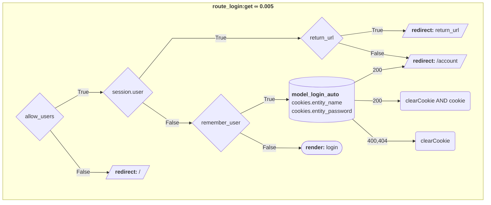
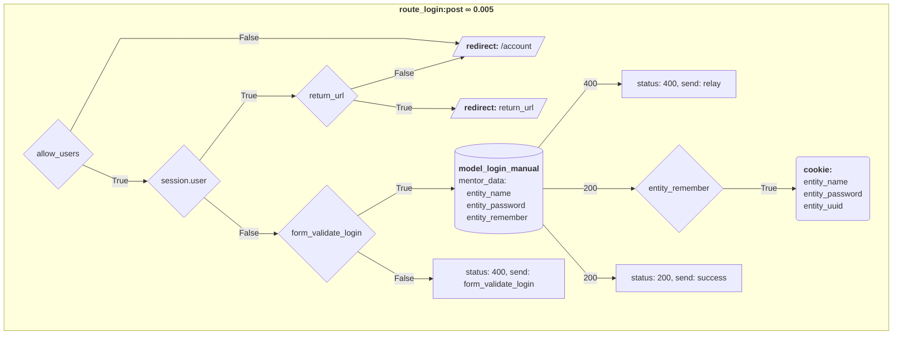

### **Phases / Planning Phase / Project Plan**

Decide on the encoding sets and supported language scripts. Decide and plan the weights and how you will generate each weight. Understand the procedures and steps. Calculate or keep track of timelines, steps procedures and pitfalls.

1.  **Project Plan** Components ∞0.001:
	1.  **Design**
	1.  **Production**

---

### **Phases / Planning Phase / Project Plan / Design**

Moduler, is a MVCRD framework. Each **module** in the **app_modules** folder holds the models, views, controllers, routes, disputes, databsaes, assets and cli.

An entity can be conscious and unconscious. Conscious entities are registered users. Entities can operate the modules, some modules require their own database set up for each user, for that reason we provide the subscribe module that handles this process by running db_ files located in the databases folder.

The standard modules are **default**, **account**, **subscribe**, **uploads**

### **Phases / Planning Phase / Project Plan / Design / Module Structure**


```
module/
├─ models/
├─ views/
│  ├─ layouts
│  └─ partials
│     └─ modals
├─ controllers/
│  ├─ dst
│  └─ src
├─ routes/
├─ mediations/
│  ├─ disputes/
│  │  ├─ dst
│  │  └─ src
│  └─ arbiters/
│     ├─ dst
│     └─ src
├─ assets/
│  ├─ js/
│  │  ├─ dst
│  │  └─ src
│  ├─ css/
│  │  ├─ dst
│  │  └─ src
│  └─ */
├─ databases/
│  ├─ models/
│  └─ builds/
└─ cli/

```

---

### **Phases / Planning Phase / Project Plan / Design / Module Structure / Models**

Models contain js files with SQL queries to the various databases

---

### **Phases / Planning Phase / Project Plan / Design / Module Structure / Views**

Moduler uses Handlebars to parse HBS and compile it to HTML. For flexibility in the design of each module, the view folder holds a layout specific to the module and the partials that it might require, those might be individual files or similar files like modals.

---

### **Phases / Planning Phase / Project Plan / Design / Module Structure / Controllers**

The controllers are javascript files responsible for interactions in the page. Those invoke the distributor, sector (partial loading), mentor, data_manage and inputvalidator.

---

### **Phases / Planning Phase / Project Plan / Design / Module Structure / Routes**

The routes hold all the POST and GET functions available for each module of the app and the API. The API is closelly knit to the CLI functionality.

---

### **Phases / Planning Phase / Project Plan / Design / Module Structure / Disputes**

Separation of logic from the app requires the Mediator and Arbiter pattern that is contained in the dispute javascript files. Those hold all the validations that might need to happen on the client or the server.

---

### **Phases / Planning Phase / Project Plan / Design / Module Structure / Databases**

Database creation files for each module, those can be required for the module to function or for user interactions with the module.

---

### **Phases / Planning Phase / Project Plan / Design / Module Structure / CLI**

The CLI (Command Line Interface) allows access to the API allong with other functionality you might require to run on your server. That might allow you to manage entities, create subscriptions and other module specific functionality.


---

### **Phases / Planning Phase / Project Plan / Design / Modules**

ABC


---

### **Phases / Planning Phase / Project Plan / Design / Modules / Entity**

The Entity module is designed to handle user/entity registration and account management.

#### Login Route

##### GET



---


##### POST




---


### **Phases / Planning Phase / Project Plan / Production**

BUMP


---

### **Phases / Planning Phase / Project Plan / Installation**

On the client side, wether you want to use the library headless or acting on an element, you will need to include:

the CSS:

```<link href="../lib/em.css" rel="stylesheet" type="text/css">```

the Javascript:

**Common JS (CJS)**:

```<script src="../lib/em.js" type="text/javascript"></script>```

or

**ES (ECMAScript module)**:

```<script src="../src/em.es.js" type="module"></script>```

and the language file(s) you will need:

```<script src="../src/languages/em.bash.js" type="text/javascript"></script>```

---

### **Phases / Planning Phase / Project Plan / Usage**

After installation you can use Emphase in any of the following ways:

* Common JS (CJS):
    * Element (client-side)
    * Headless (server-side or client-side)
* ES (ECMAScript module):
    * Element (client-side)
    * Headless (server-side or client-side)


---

#### CJS Element:

Element:

```
<code class="lang-bash">
#!/bin/bash

if [ $a  -eq  true ]
then
  echo "A 'a'"
else
  echo "B 'b'"
fi
'</code>
```

Script:

```
const emphase = require("emphase");
var em = new emphase();

console.log( em.emphasize(document.querySelector(".lang-bash"), 'bash').result );

```

---

#### CJS Headless:

```
const emphase = require("emphase");
var em = new emphase();

string = `
#!/bin/bash

if [ $a  -eq  true ]
then
  echo "A 'a'"
else
  echo "B 'b'"
fi
`;

console.log( em.emphasize(string, 'bash').result );

```

---

#### ES Element:

Element:

```
<code class="lang-bash">
#!/bin/bash

if [ $a  -eq  true ]
then
  echo "A 'a'"
else
  echo "B 'b'"
fi
'</code>
```

Script:

```
const emphase = require("emphase");
var em = new emphase();

console.log( em.emphasize(document.querySelector(".lang-bash"), 'bash').result );

```

---

#### ES Headless:

```
const emphase = require("emphase");
var em = new emphase();

string = `
#!/bin/bash

if [ $a  -eq  true ]
then
  echo "A 'a'"
else
  echo "B 'b'"
fi
`;

console.log( em.emphasize(string, 'bash').result );

```

---

### **Phases / Planning Phase / Project Plan / Usage / CLI Usage**

To use the command line directly like so ```cli --add_admin```, run ```npm link``` in the main directory once.

The command line functions are stored in the package/bin:

```

  "bin": {
    "cli": "./bin/cli.js",
    "pack": "./bin/pack.js"
  },

```

To use the CLI the server must be running.
